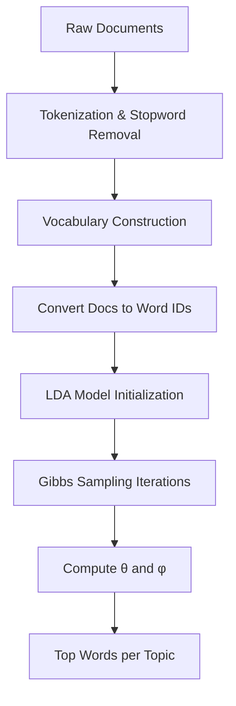

# Latent Dirichlet Allocation (LDA) in Rust

A Rust implementation of **Latent Dirichlet Allocation (LDA)** using **collapsed Gibbs sampling** for topic modeling.

---

## **Overview**
This crate provides:
- Tokenization with stopword removal
- Vocabulary construction
- LDA model with:
  - Hyperparameters: `k` (topics), `alpha`, `beta`
  - Gibbs sampling for inference
- Functions to extract:
  - Document-topic distributions (`θ`)
  - Topic-word distributions (`φ`)
  - Top words per topic

---

## **Architecture Diagram**



---

## **Mathematical Background**

LDA assumes:
- Each document is a mixture of topics.
- Each topic is a distribution over words.

### **Generative Process**
1. For each document $ d $:
   - Draw topic proportions:
     $$ 	heta_d \sim 	ext{Dirichlet}(lpha) $$
2. For each word position $ i $ in document $ d $:
   - Draw topic:
     $$ z_{di} \sim 	ext{Categorical}(	heta_d) $$
   - Draw word:
     $$ w_{di} \sim 	ext{Categorical}(\phi_{z_{di}}) $$

---

### **Collapsed Gibbs Sampling**
We integrate out $ 	heta $ and $ \phi $, sampling topic assignments $ z $ using:

$$
p(z_{di} = t \mid \mathbf{z}_{-di}, \mathbf{w}) \propto
ig( n_{d,t}^{-di} + lpha ig) \cdot
rac{ n_{t,w}^{-di} + eta }{ n_t^{-di} + V eta }
$$

Where:
- $ n_{d,t}^{-di} $: count of topic $ t $ in document $ d $ excluding current word
- $ n_{t,w}^{-di} $: count of word $ w $ in topic $ t $ excluding current word
- $ n_t^{-di} $: total words assigned to topic $ t $ excluding current word
- $ V $: vocabulary size

---

### **Parameter Estimation**
- Document-topic distribution:
$$
	heta_{d,t} = rac{ n_{d,t} + lpha }{ N_d + K lpha }
$$

- Topic-word distribution:
$$
\phi_{t,w} = rac{ n_{t,w} + eta }{ n_t + V eta }
$$

---

## **Usage Example**
```rust
use lda::Lda;

fn main() {
    let docs = [
        "Rust is a systems programming language",
        "Topic modeling with LDA in Rust",
        "Gibbs sampling for probabilistic models"
    ];

    let mut model = Lda::from_documents(3, 0.1, 0.01, &docs, 42);
    model.train(500);

    println!("Top words per topic:");
    for (topic_id, words) in model.topics(5) {
        println!("Topic {}: {:?}", topic_id, words);
    }
}
```

---

## **Performance Tips**
- Use larger `iters` for better convergence.
- Tune `alpha` and `beta` for your dataset.
- Preprocess documents for consistent tokenization.

---
